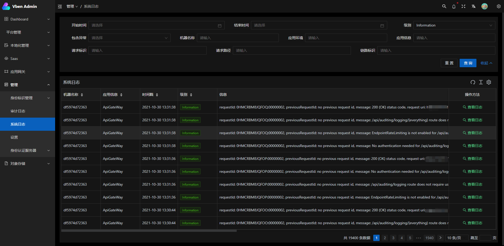
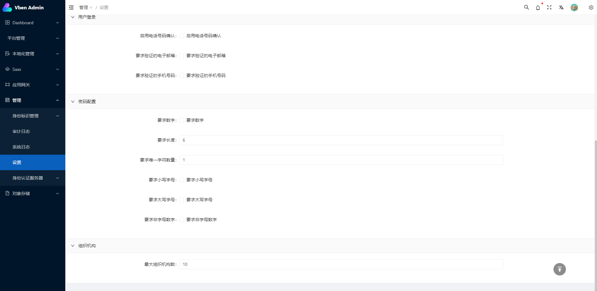
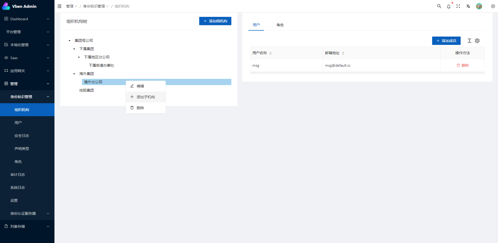

English | [简体中文](./README.md)

[RELEASE](./RELEASE.md) RELEASE

## Overview

This is a [vue-vben-admin](https://github.com/anncwb/vue-vben-admin) -based Abp framework background management interface

## Quick Start

### 1、Install cli

```shell
  dotnet tool install --global LINGYUN.Abp.Cli
```

### 2、Install .NET Template

```shell
  dotnet new --install LINGYUN.Abp.MicroService.Templates
```

### 3、Use cli create new project

```shell
  # use sqlserver
  # MyCompanyName you company name
  # MyProjectName you project name
  # MyPackageName you package name
  # -o  See: abp cli
  # --dbms  See: abp cli
  # --cs    See: abp cli
  # --no-random-port See: abp cli
  labp create MyCompanyName.MyProjectName -pk MyPackageName -o "D:\Project" --dbms sqlserver --cs "Server=127.0.0.1;Database=MyProject;User Id=sa;Password=123456" --no-random-port

  cd D:\Project\host\MyPackageName.MyCompanyName.MyProjectName.HttpApi.Host

  dotnet restore

  dotnet run

  start http://127.0.0.1:5000/

```

### Feedback

* The author is not a freelancer and does not have much time to maintain the project. If there is a problem, please contact **colin.in@foxmail.com** by email  

## Screenshots










## Related Projects

[abpframework/abp](https://github.com/abpframework/abp) (abp vNext)

[EasyAbp/Cap](https://github.com/EasyAbp/Abp.EventBus.CAP) (EasyAbp)

[DotNetCore/CAP](https://github.com/dotnetcore/CAP) (CAP)

Javascript version:

[vue-vben-admin](https://github.com/anncwb/vue-vben-admin.git) (vue-vben-admin)

## Preparation

- [node](http://nodejs.org/) and [git](https://git-scm.com/) - Project development environment
- [Vite](https://vitejs.dev/) - Familiar with vite features
- [Vue3](https://v3.vuejs.org/) - Familiar with Vue basic syntax
- [TypeScript](https://www.typescriptlang.org/) - Familiar with the basic syntax of `TypeScript`
- [Es6+](http://es6.ruanyifeng.com/) - Familiar with es6 basic syntax
- [Vue-Router-Next](https://next.router.vuejs.org/) - Familiar with the basic use of vue-router
- [Ant-Design-Vue](https://2x.antdv.com/docs/vue/introduce-cn/) - ui basic use
- [Mock.js](https://github.com/nuysoft/Mock) - mockjs basic syntax

## Project Structure

```bash
├── mock/                      # mock server & mock data
├── public                     # public static assets (directly copied)
│   │── favicon.ico            # favicon
│   │── manifest.json          # PWA config file
│   └── index.html             # index.html template
├── src                        # main source code
│   ├── api                    # api service
│   ├── assets                 # module assets like fonts, images (processed by webpack)
│   ├── components             # global components
│   ├── directives             # global directives
│   ├── enums                  # global enums
│   ├── hooks                  # global hooks
│   ├── locales                # locales
│   ├── layout                 # layouts
│   ├── router                 # router
│   ├── settings               # global settings
│   ├── store                  # store
│   ├── utils                  # global utils
│   ├── views                  # views
│   ├── App.vue                # main app component
│   ├── main.ts                # app entry file
├── types                      # types
├── tests/                     # tests
├── .env.xxx                   # env variable configuration
├── .eslintrc.js               # eslint config
├── jest.config.js             # jest unit test config
├── package.json               # package.json
├── postcss.config.js          # postcss config
├── tsconfig.json              # typescript config
└── vite.config.js             # vue vite config
```

## Project setup

With [yarn](https://yarnpkg.com/lang/en/) or [npm](https://www.npmjs.com/get-npm)


#### Install dependencies

```bash
yarn install

```

### Custom vue project config

Modify the server address that the development environment will use for the proxy. Provide the following three addresses: IdentityService, IdentityServer, and ApiService

```bash
VITE_PROXY = [["/connect","http://127.0.0.1:44385"],["/api","http://127.0.0.1:30000"],["/signalr-hubs","ws://127.0.0.1:30000"]]
```

Modify the actual address of the production environment, as above

```bash
# STS Connect
# token issue
VITE_GLOB_AUTHORITY='http://127.0.0.1:44385'
# client id
VITE_GLOB_CLIENT_ID='vue-admin-element'
# client secret
VITE_GLOB_CLIENT_SECRET='1q2w3e*'
```

### EntityFramework migration

Please switch to the service project startup directory and execute the **dotnet EF ** command for database migration

example:

``` shell

cd aspnet-core/services/admin/LINGYUN.BackendAdminApp.Host

dotnet ef database update

```

- You can also use quick migration script files: **./build/build-aspnetcore-ef-update.ps1**

### Configure the RabbitMQ

Therefore project design for the micro service architecture, with the method of distributed event, communication between project USES is [DotNetCore/CAP](https://github.com/dotnetcore/CAP)

The communication mode is **RabbitMQ Server**, so you need to install **RabbitMQ** in advance. Please refer to the official website for the specific installation mode


Then you need to change the **CAP:RabbitMQ** configuration in the configuration file to set it to your own defined configuration. The **rabbitmq_management** plug-in is recommended for quick management of **RabbitMQ**


### Compiles background services

```shell
cd aspnet-core/services

start-all-service.bat

```

#### Compiles and hot-reloads for development

```shell

cd apps/vue

yarn dev

```

#### Compiles and minifies for production

```bash
yarn run build
```

### About Docker container

**Step 1**: Building background services, powershell script: **./build/build-aspnetcore-release.ps1**,  **Warning: after the release of service need configuration file: appsettings.Production.json**

**Step 2**: Build the front-end, **./build/build-vue-apps.ps1**

**Step 3**: Build after the release of the address of the default in **./aspnet-core/services/Publish**, change nginx proxy server address: **./client/docker/nginx/default.conf**

**Step 4**: Run command **sudo docker-compose down && sudo docker-compose -f docker-compose.yml -f docker-compose.override.yml up --build -d**

**Using A CI tool such as Jenkins is recommended to simplify this into a single step**

#### Lints and fixes files

```bash
yarn lint:eslint
```

#### Run your unit tests

```bash
yarn run test:unit
```


## How to contribute

You are very welcome to join！Raise an issue Or submit a Pull Request。

**Pull Request:**

1. Fork code!
2. Create your own branch: `git checkout -b feat/xxxx`
3. Submit your changes: `git commit -am 'feat(function): add xxxxx'`
4. Push your branch: `git push origin feat/xxxx`
5. submit`pull request`

## Git Contribution submission specification

- reference [vue](./apps/vue/.github/COMMIT_CONVENTION.md) specification ([Angular](https://github.com/conventional-changelog/conventional-changelog/tree/master/packages/conventional-changelog-angular))

  - `feat` Add new features
  - `fix` Fix the problem/BUG
  - `style` The code style is related and does not affect the running result
  - `perf` Optimization/performance improvement
  - `refactor` Refactor
  - `revert` Undo edit
  - `test` Test related
  - `docs` Documentation/notes
  - `chore` Dependency update/scaffolding configuration modification etc.
  - `workflow` Workflow improvements
  - `ci` Continuous integration
  - `types` Type definition file changes
  - `wip` In development

## Related warehouse

If these plugins are helpful to you, you can give a star support

- [vite-plugin-mock](https://github.com/anncwb/vite-plugin-mock) - Used for local and development environment data mock
- [vite-plugin-html](https://github.com/anncwb/vite-plugin-html) - Used for html template conversion and compression
- [vite-plugin-style-import](https://github.com/anncwb/vite-plugin-style-import) - Used for component library style introduction on demand
- [vite-plugin-theme](https://github.com/anncwb/vite-plugin-theme) - Used for online switching of theme colors and other color-related configurations
- [vite-plugin-imagemin](https://github.com/anncwb/vite-plugin-imagemin) - Used to pack compressed image resources
- [vite-plugin-compression](https://github.com/anncwb/vite-plugin-compression) - Used to pack input .gz|.brotil files
- [vite-plugin-svg-icons](https://github.com/anncwb/vite-plugin-svg-icons) - Used to quickly generate svg sprite

## Browser support

The `Chrome 80+` browser is recommended for local development

Support modern browsers, not IE

| [](http://godban.github.io/browsers-support-badges/)</br>IE | [](http://godban.github.io/browsers-support-badges/)</br>Edge | [](http://godban.github.io/browsers-support-badges/)</br>Firefox | [](http://godban.github.io/browsers-support-badges/)</br>Chrome | [](http://godban.github.io/browsers-support-badges/)</br>Safari |
| :-: | :-: | :-: | :-: | :-: |
| not support | last 2 versions | last 2 versions | last 2 versions | last 2 versions |


## License

[MIT License](./LICENSE)
